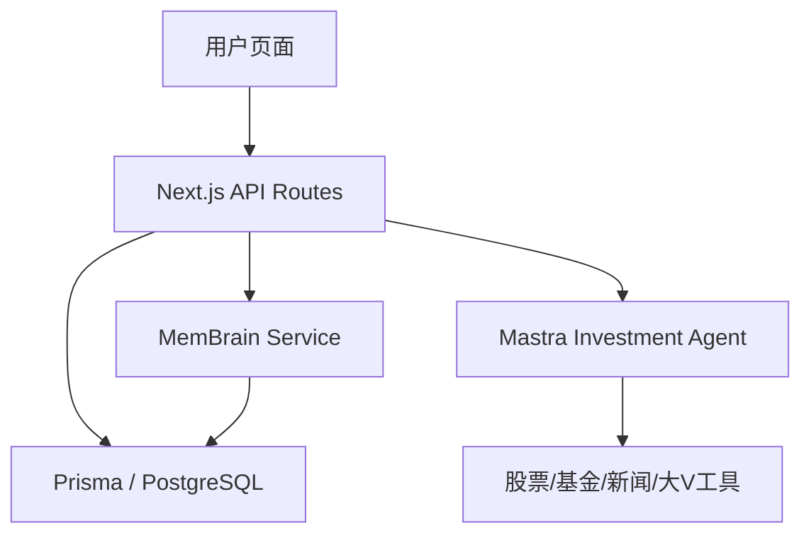

# MemBrain MVP 接入方案

## 目标
在当前 `ai-investment-assistant` 项目中落一版可运行的 MemBrain MVP，让产品从“一次性聊天问答”升级为“能记住用户偏好、记录自选逻辑、沉淀分析快照”的投资助手。

## 当前项目现实边界
项目当前已有能力：
- 用户登录与会话
- 自选股 / 自选基金
- 聊天问答
- 股票分析、新闻、大V观点

项目当前还没有完整的：
- 持仓系统
- 事件预警中心
- 复盘系统
- 专门的长期记忆层

因此本次 MemBrain MVP 不追求一次补齐全部投研闭环，而是先围绕现有能力落 3 个最有价值的长期记忆对象：

1. 用户投资画像
2. 自选股逻辑卡片
3. AI 分析快照

## 在本项目中的定位
MemBrain 在本项目中不是外部独立产品，而是内部长期记忆层。

职责：
- 记住用户是谁
- 记住用户偏好什么风格
- 记住用户为什么关注某只股票
- 记住 AI 过去怎么分析过某只股票
- 在新的聊天请求到来时，把相关记忆注入上下文

不负责：
- 实时行情主存储
- 公告原文主存储
- 财务数据主存储
- 交易执行

## 总体架构


## MVP 数据对象

### 1. User Investment Profile
用于描述用户风险偏好和投资风格。

字段建议：
- `riskPreference`: 保守 / 平衡 / 进取
- `investmentStyle`: 成长 / 红利 / 事件驱动 / 低估值 等
- `holdingPeriodPreference`: 短线 / 波段 / 中期
- `preferredEvidence`: 财报 / 政策 / 订单 / 资金面
- `dislikedPatterns`: 纯题材 / 高波动小盘股 等
- `summary`: 给模型看的短摘要

### 2. Watchlist Thesis
用于解释“为什么关注这只股票”，这是自选系统最缺的一层。

字段建议：
- `symbol`
- `market`
- `watchReason`
- `bullPoints`
- `bearPoints`
- `watchSignals`
- `invalidationConditions`
- `lastJudgement`

### 3. Analysis Snapshot
用于沉淀一条分析快照，而不是只留完整聊天记录。

字段建议：
- `symbol`
- `title`
- `summary`
- `bullPoints`
- `bearPoints`
- `keyChange`
- `confidence`
- `sourceType`（chat / watchlist-insight / manual）

## 推荐接口

### 用户画像
- `GET /api/memory/profile`
- `PUT /api/memory/profile`

### 自选逻辑
- `GET /api/memory/watchlist-thesis?code=xxx&market=1`
- `PUT /api/memory/watchlist-thesis`

### 分析快照
- `GET /api/memory/analysis-snapshots?code=xxx&market=1`
- `POST /api/memory/analysis-snapshots`

### 聚合上下文
- `GET /api/memory/context?query=xxx&code=xxx&market=1`

## 聊天接入策略
`/api/chat` 在调用 Agent 之前增加一步：

1. 识别当前问题里的股票代码 / 股票名称 / 主题信息
2. 读取当前用户画像
3. 读取相关股票的自选逻辑卡片
4. 读取最近几条分析快照
5. 把以上内容组装成一条简短的 system context 注入到消息顶部

输出示例：
```text
以下是该用户的长期记忆，请在回答时优先参考，但如果和最新市场事实冲突，以最新事实为准：
- 用户偏好：平衡型，更看重财报兑现，不喜欢纯题材炒作。
- 关注标的：600519 贵州茅台
- 关注原因：消费龙头，关注高端白酒需求与估值切换。
- 最近判断：估值压力仍在，但中期现金流和品牌力仍是支撑。
```

## 页面落点

### 1. 自选页
对每只股票增加：
- 查看 / 编辑“关注逻辑”入口
- 查看最近分析快照入口

### 2. AI 聊天页
先不增加复杂新页面，只在后端注入记忆上下文。
后续可以补：
- “本次回答已参考你的投资画像 / 历史判断” 提示

### 3. 新增记忆设置页
建议新增 `/memory` 页面，集中维护：
- 用户投资画像
- 自选逻辑卡片列表
- 最近分析快照

## 写入策略
不做“每次聊天都写长期记忆”。
只在以下场景写入：
- 用户保存投资画像
- 用户保存某只股票的关注逻辑
- 用户主动把一次分析沉淀为快照
- 系统在特定场景自动保存简化快照

## 成功标准
如果 MemBrain MVP 有效，应看到：
- 用户第二次问同一只股票时，回答明显更连续
- 回答能引用“为什么关注这只股票”而不是只看新闻
- 自选页不再只是列表，而开始具备“研究卡片”属性
- 用户可回看最近分析，不必翻整段聊天记录

## 后续增强方向
- 持仓逻辑卡片
- 事件影响卡片
- 复盘记录
- 主动预警
- 大V 观点偏好记忆
- 分析快照自动结构化提取
